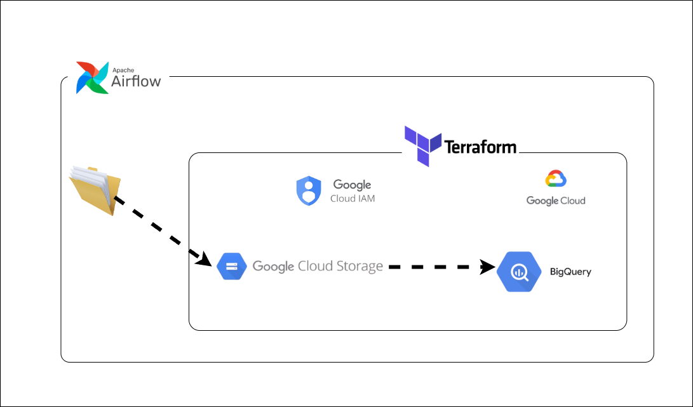

# Workforce Data Pipeline (Local File ===> GCS ===> Bigquery)

## Overview

This project demonstrates a simple end-to-end data engineering pipeline built using Apache Airflow (via Astro CLI), Docker, and Google Cloud Platform.

The pipeline uploads workforce datasets saved locally to a Google Cloud Storage (GCS) bucket and then loads the uploaded data into a BigQuery table for downstream analysis. The pipleline makes use of **Apache Airflow** for orchestration and **GSCOperator** for data movement and **Terraform** for provisioning the infrastructure. 

---

# Architecture


---

# Technologies Used

| Technology | Purpose |
|------------|---------|
| Python | Generate sample workforce data |
| Pandas | Data manipulation |
| Apache Airflow | Workflow orchestration |
| Astro CLI | Local Airflow development |
| Docker | Containerised environment |
| Google Cloud Storage | Store raw CSV files |
| BigQuery | Data warehouse |
| Terraform | Provision cloud resources |
| Git & GitHub | Version control |

---
# Problem Statement

Many organisations rely on manual processes to move data from local systems into cloud-based analytics platforms. These manual workflows are often time-consuming, error-prone, difficult to monitor, and challenging to scale as data volumes increase. Delays or inconsistencies in data ingestion can lead to inaccurate reporting and slower decision-making.

This project demonstrates how a modern data engineering pipeline can automate the process of ingesting data into Google Cloud Platform (GCP). Using Terraform for infrastructure provisioning, Apache Airflow for orchestration, Google Cloud Storage (GCS) for intermediate storage, and BigQuery as the analytical data warehouse, the pipeline provides a repeatable, reliable, and scalable solution for loading structured data into the cloud.

The project showcases Infrastructure as Code (IaC), workflow orchestration, and cloud-native data engineering practices that are commonly used in production environments.

---
# Project Objectives

The pipeline is designed to:

**.** Provision cloud infrastructure using Terraform.

**.** Upload a local CSV dataset to Google Cloud Storage.

**.** Orchestrate the workflow using Apache Airflow.

**.** Load data from GCS into a BigQuery table.

**.** Ensure the pipeline is repeatable and easy to maintain.

**.** Demonstrate best practices for Infrastructure as Code and workflow automation.

---
# Project Workflow

The pipeline performs the following tasks:

**1.** Terraform creates the required Google Cloud resources:

       Google Cloud Storage Bucket

       BigQuery Dataset

       BigQuery Table

       Required IAM permissions
       
**2.** Apache Airflow starts the ETL workflow.

**3.** The LocalFilesystemToGCSOperator uploads the CSV file from the local machine to the GCS bucket.

**4.** The GCSToBigQueryOperator imports the CSV file into a BigQuery table.

**5.** BigQuery stores the structured data, making it available for querying and analytics.
```

---

# Workflow

## Step 1

Generate a workforce dataset using Python.

The dataset is saved with a timestamp to ensure that each execution creates a new file.

Example

```
workforce_20260716_181500.csv
```

---

## Step 2

Airflow searches the local data directory and uploads every CSV file to Google Cloud Storage.

Destination example

```
gs://ade-demo-bucket-123456/raw/
```

---

## Step 3

Airflow loads the uploaded CSV files into BigQuery.

The resulting table can then be queried using SQL or visualised in BI tools such as Power BI or Looker Studio.

---

# DAG Overview

The DAG consists of two main tasks.

```
upload_csv
      |
      |
      v
load_gcs_data_to_bq
```

### upload_csv

Uses

```
LocalFilesystemToGCSOperator
```

Purpose

- Reads CSV files from the local directory
- Uploads them into GCS

---

### load_gcs_data_to_bq

Uses

```
GCSToBigQueryOperator
```

Purpose

- Reads uploaded files
- Loads data into BigQuery
- Creates the destination table if required

---

# Running the Project

## Start Astro

```bash
astro dev start
```

---

## List DAGs

```bash
astro dev run dags list
```

---

## Test DAG

```bash
astro dev run dags test workforce_pipeline
```

---

## View Logs

```bash
astro dev logs scheduler
```

---

## Open Airflow

```
http://localhost:8080
```

---

# Configuration

Project configuration is stored in

```
config.py
```

Example

```python
project_id = "your-project-id"

gcs_bucket_name = "your-bucket"

data_source_path = "/usr/local/airflow/dags/data"

dataset_id = "ade_demo_bigquery"

table_name = "practice_table"
```

---

# Sample Output

Generated files

```
workforce_20260716_190020.csv
workforce_20260716_190150.csv
workforce_20260716_190400.csv
```

Uploaded objects

```
gs://ade-demo-bucket-123456/raw/workforce_20260716_190020.csv

gs://ade-demo-bucket-123456/raw/workforce_20260716_190150.csv
```

BigQuery

```
practice_table
```

---

# Key Learning Outcomes

Through this project I learned how to:

- Build an Apache Airflow DAG using Astro CLI
- Containerise an Airflow environment using Docker
- Upload local files into Google Cloud Storage
- Load data from GCS into BigQuery
- Configure Airflow providers for Google Cloud
- Debug Airflow task failures using scheduler logs
- Work with Airflow Operators
- Use timestamped file generation to avoid overwriting files
- Organise Airflow projects using configuration files

---

# Future Improvements

Potential enhancements include:

- Add data quality validation using Great Expectations
- Implement incremental loading into BigQuery
- Archive processed files instead of re-uploading
- Introduce dbt for data transformation
- Trigger the pipeline using Cloud Composer
- Add monitoring and alerting
- Deploy using CI/CD with GitHub Actions
- Parameterise the pipeline using Airflow Variables
- Store secrets in Secret Manager

---

# Author

**Abdulmalik Ademola Adesokan**

Data Analyst | Aspiring Data Engineer

GitHub:
(Your GitHub URL)

LinkedIn:
(Your LinkedIn URL)
